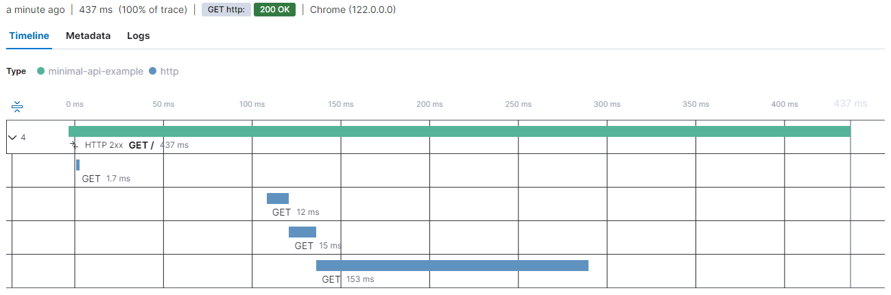

[](https://github.com/elastic/elastic-otel-dotnet/actions/workflows/ci.yml)

# Elastic OpenTelemetry .NET Distribution

The Elastic OpenTelemetry .NET Distribution provides a zero code change extension to [OpenTelemetry SDK for .NET](https://opentelemetry.io/docs/languages/net). These extensions ensure a smooth and rich out of the box experience with [Elastic Observability](https://www.elastic.co/observability) through strictly OpenTelemetry native means.

This ensures there are no new concepts to learn with the full OpenTelemetry ecosystem remains at ones fingertips. Read more about the concept of [OpenTelemetry Distributions](https://opentelemetry.io/docs/concepts/distributions).

The Elastic distribution includes some Elastic-specific processors to ensure the best 
compatibility when exporting OpenTelemetry signal data [Elastic Observability](https://www.elastic.co/observability). The distribution also preconfigures the collection of tracing, metrics and logs signals, applying some opinionated defaults, such as which sources are collected by default. The distribution also ensures that the OTLP exporter is enabled 
by default.

> **_IMPORTANT:_**  The Elastic distribution is currently in early alpha release status. It is not yet feature
complete and may contain bugs. We are actively working on improving the distribution and
adding new features.
>
>  If you would like to experience the alpha and help us improve the distribution by providing
early feedback, you can follow the steps below to get started.

## Getting started

As the distribution is a lightweight extension of the OpenTelemetry SDK, you should be broadly 
familiar with the OpenTelemetry SDK concepts and instrumenting applications using the Microsoft
diagnostic APIs. If you are not, we recommend you read the 
[OpenTelemetry SDK documentation](https://opentelemetry.io/docs/languages/net) first.

It's an explicit goal of this distribution to introduce **no new concepts** as defined by the wider OpenTelemetry community. 

### Prerequisites

The current documentation and examples are written with .NET 6 and newer applications in mind. 
Before continuing, ensure that you have a supported 
[.NET SDK version](https://dotnet.microsoft.com/en-us/download/dotnet) installed locally.

### Installation

To get started with the Elastic OpenTelemetry .NET Distribution, you must add the [`Elastic.OpenTelemetry`](https://www.nuget.org/packages/Elastic.OpenTelemetry)
NuGet package to your project. This can be achieved by adding the package reference to your project file.

```xml
<PackageReference Include="Elastic.OpenTelemetry" Version="0.1.0-alpha.1" />
```

After adding the package reference, you can start using the Elastic OpenTelemetry distribution 
in your application. The distribution includes a transitive dependency on the OpenTelemetry SDK, 
so you do not need to add the OpenTelemetry SDK package to your project, although doing so will 
cause no harm and may be used to opt into newer SDK versions before the Elastic distribution 
references them.

The Elastic OpenTelemetry distribution is designed to be easy to use and integrate into your 
applications. This includes applications which have previously used the OpenTelemetry SDK directly. 
In situations where the OpenTelemetry SDK is already used, the only required change is  
to add the [`Elastic.OpenTelemetry`](https://www.nuget.org/packages/Elastic.OpenTelemetry) NuGet package to the project. Doing so will automatically 
switch to the opinionated configuration provided by the Elastic distribution.

### ASP.NET Core usage

A common requirement is to instrument ASP.NET Core applications based on the `Microsoft.Extensions.Hosting` 
libraries which provide dependency injection via an `IServiceProvider`.

The OpenTelemetry SDK and the Elastic distribution provide extension methods to enable observability 
features in your application by adding a few lines of code.

In this section, we'll focus on instrumenting an ASP.NET Core minimal API application using the Elastic 
OpenTelemetry distribution. Similar steps can also be used to instrument other ASP.NET Core workloads 
and other host-based applications such as [worker services](https://learn.microsoft.com/en-us/dotnet/core/extensions/workers).

> **_NOTE:_** These examples assume the use of the top-level statements feature introduced in C# 9.0 and the 
default choice for applications created using the latest templates.

To take advantage of the OpenTelemetry SDK instrumentation for ASP.NET Core, add the following 
NuGet package to your project:

```
<PackageReference Include="OpenTelemetry.Instrumentation.AspNetCore" Version="1.7.0" />
```

This package includes instrumentation to collect traces for requests handled by ASP.NET Core endpoints.

> **_NOTE:_** The ASP.NET Core instrumentation is not included by default in the Elastic OpenTelemetry distribution. 
As with all optional instrumentation libraries, you can choose to include them in your application by 
adding a suitable package reference.

Inside the `Program.cs` file of the ASP.NET Core application, add the following two using directives:

```csharp
using OpenTelemetry;
using OpenTelemetry.Trace;
```

The OpenTelemetry SDK provides extension methods on the `IServiceCollection` to support enabling the 
providers and configuring the SDK. The Elastic distribution overrides the default SDK registration, 
adding several opinionated defaults.

In the minimal API template, the `WebApplicationBuilder` exposes a `Services` property that can be used 
to register services with the dependency injection container. To enable tracing and metrics collection, 
ensure that the OpenTelemetry SDK is registered.

```csharp
var builder = WebApplication.CreateBuilder(args);

builder.Services
	.AddHttpClient() <1>
	.AddOpenTelemetry() <2>
		.WithTracing(t => t.AddAspNetCoreInstrumentation()); <3>
```
<1> The `AddHttpClient` method registers the `IHttpClientFactory` service with the dependency 
injection container. This is NOT required to enable OpenTelemetry, but the example endpoint will use it to 
send an HTTP request.

<2> The `AddOpenTelemetry` method registers the OpenTelemetry SDK with the dependency injection 
container. When available, the Elastic distribution will override this to add opinionated defaults.

<3> Configure tracing to instrument requests handled by ASP.NET Core.

With these limited changes to the `Program.cs` file, the application is now configured to use the 
OpenTelemetry SDK and the Elastic distribution to collect traces and metrics, which are exported via 
OTLP.

To demonstrate the tracing capabilities, add a simple endpoint to the application:

```csharp
app.MapGet("/", async (IHttpClientFactory httpClientFactory) =>
{
	using var client = httpClientFactory.CreateClient();

	await Task.Delay(100);
	var response = await client.GetAsync("http://elastic.co"); <1>
	await Task.Delay(50);

	return response.StatusCode == System.Net.HttpStatusCode.OK ? Results.Ok() : Results.StatusCode(500);
});
```
<1> Using this URL will require two redirects, allowing us to see multiple spans in the trace.

The Elastic distribution will automatically enable the exporting of signals via the OTLP exporter. This 
exporter requires that endpoint(s) are configured. A common mechanism for configuring endpoints is 
via environment variables. 

This demo uses an Elastic Cloud deployment as the destination for our observability data. From Kibana 
running in Elastic Cloud, navigate to the observability set up guides. Select the OpenTelemetry option 
to view the configuration details that should be supplied to the application.


Configure environment variables for the application either in `launchSettings.json` or in the environment 
where the application is running. 

Once configured, run the application and make a request to the root endpoint. A trace will be generated 
and exported to the OTLP endpoint.

To view the traces, you can use the Elastic APM UI.



### Microsoft.Extensions.Hosting usage

For console applications, services, etc that are written against a builder that exposes an `IServiceCollection`
you can install this package:

```xml
<PackageReference Include="Elastic.OpenTelemetry" Version="0.1.0-alpha.1" />
```
and ensure you call `AddOpenTelemetry` to enable OpenTelemetry just like you would when using OpenTelemetry directly. Our package intercepts this call to set up our defaults but can be further build upon as per usual:

```
var builder = Host.CreateApplicationBuilder(args);

builder.Services.AddOpenTelemetry()
	.ConfigureResource(r => r.AddService(serviceName: "MyService"))
	.WithTracing(t => t.AddSource(Worker.ActivitySourceName).AddConsoleExporter())
	.WithMetrics(m => m.AddMeter(Worker.MeterName).AddConsoleExporter());
```

### Manual Instrumentation usage

In environments where no `IServiceCollection` is naturally available you may manually start instrumenting by creating an instance of `ElasticOpenTelemetryBuilder`. 

```csharp
await using var session = new ElasticOpenTelemetryBuilder()
    .WithTracing(b => b.AddSource(ActivitySourceName))
    .Build();
```

This will setup instrumentation for as long as `session` is not disposed.


`ElasticOpenTelemetryBuilder` is an implementation of [`IOpenTelemetryBuilder`](https://github.com/open-telemetry/opentelemetry-dotnet/blob/70657395b82ba00b8a1e848e8832b77dff94b6d2/src/OpenTelemetry.Api.ProviderBuilderExtensions/IOpenTelemetryBuilder.cs#L12). 

This is important to know because any instrumentation configuration is automatically exposed by the base OpenTelemetry package as extension methods on `IOpenTelemetryBuilder`. You will not lose functionality
by using our builder.


